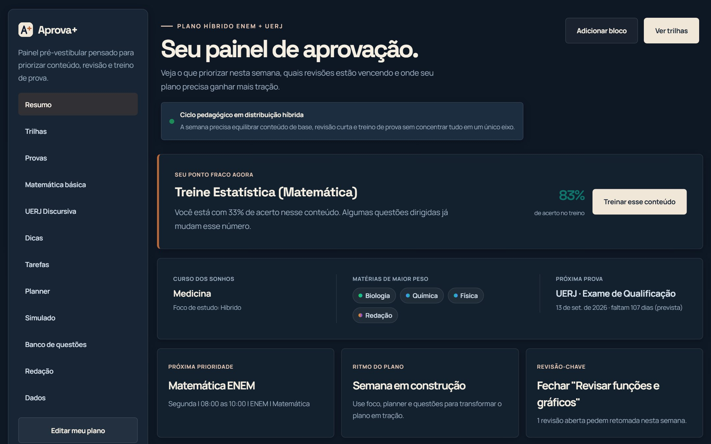

# Aprova+ · Plataforma pré-vestibular para ENEM e UERJ

Plataforma web que transforma uma rotina de estudos solta em **preparação guiada**: planejamento semanal, blocos de foco (Pomodoro), mini simulados e leitura de progresso — tudo no mesmo fluxo, sem trocar de ferramenta.

> **Demo ao vivo:** _em breve_ · **Código:** este repositório



<!-- Após o deploy (Vercel / Netlify / GitHub Pages), troque "em breve" pelo link real. -->
<!-- Dica: um GIF curto do dashboard em uso converte ainda mais que o print. -->

---

## Por que este projeto

Construído **do zero, em JavaScript puro (sem framework)** para demonstrar fundamentos sólidos de front-end: arquitetura, acessibilidade, performance e gerenciamento de estado sem depender de abstrações prontas.

A escolha por vanilla foi deliberada. O objetivo era mostrar domínio da plataforma web em si — DOM, ES Modules, `IntersectionObserver`, `localStorage`, design tokens — antes de adicionar uma camada de framework. A arquitetura do dashboard é modular e isola estado, renderização e interações, de forma que a migração para React/Svelte seria evolutiva, não uma reescrita.

## Funcionalidades

- **Landing page** com hero, seções de produto/método/fluxo, FAQ acessível e SEO completo.
- **Dashboard** (`dashboard.html`) com:
  - **Planner semanal** — sessões com dia, horário, matéria e prova.
  - **Pomodoro / blocos de foco** — timer com ciclo que para quando ocioso (sem `setInterval` desperdiçado).
  - **Mini simulados** — banco de questões com leitura de acerto.
  - **Trilhas de estudo** e biblioteca de vídeos por matéria.
  - **Analytics** — meta semanal, streak, distribuição por matéria e prontidão.
- **Persistência local** via `localStorage` (estado sobrevive ao reload).

## Stack

| Camada | Tecnologia |
|---|---|
| Marcação | HTML5 semântico |
| Estilo | CSS moderno — custom properties (design tokens), Grid, Flexbox, `clamp()` |
| Lógica | JavaScript (ES Modules, sem framework) |
| Testes | [Vitest](https://vitest.dev) |
| Fontes | Manrope + Space Grotesk (Google Fonts, com `preconnect`) |

## Arquitetura

```
plataforma/
├── index.html              # Landing page
├── dashboard.html          # Aplicação (painel)
├── script.js               # Comportamento da landing (menu, FAQ, scrollspy, reveal)
├── styles/
│   ├── tokens.css          # Design tokens (cores, raios, sombras, transições)
│   ├── base.css            # Reset, tipografia, componentes base, a11y
│   ├── landing.css         # Estilos exclusivos da landing
│   └── dashboard.css       # Estilos exclusivos do dashboard
└── dashboard/              # Aplicação em ES Modules
    ├── main.js             # Bootstrap e ciclo de vida do Pomodoro
    ├── store.js            # Estado + seletores derivados + persistência
    ├── renderers.js        # Renderização do DOM a partir do estado
    ├── interactions.js     # Bind de eventos e handlers
    ├── dom.js              # Referências de DOM centralizadas
    ├── utils.js            # Funções puras (datas, formatação, duração)
    ├── content.js          # Conteúdo pedagógico (matérias, trilhas, questões)
    └── video-library.js    # Catálogo de vídeos por trilha
```

**Decisões que valem destacar:**
- **CSS separado por página** — a landing não baixa o CSS do dashboard e vice-versa, reduzindo o CSS crítico de cada rota.
- **Separação de responsabilidades** no dashboard: `store` (estado e seletores) → `renderers` (DOM) → `interactions` (eventos). Estado nunca é mutado direto pela UI.
- **Acessibilidade de base**: skip-link, `aria-expanded`/`aria-controls`, `aria-current` no scrollspy, `prefers-reduced-motion` respeitado, foco visível.

## Acessibilidade & SEO

- Navegação completa por teclado, foco visível e `skip-link`.
- `prefers-reduced-motion` desliga animações para quem precisa.
- Meta tags completas: Open Graph, Twitter Cards e JSON-LD (`Organization`, `SoftwareApplication`, `FAQPage`).
- `robots.txt`, `sitemap.xml`, `manifest` e `canonical` configurados.

## Testes

Funções puras cobertas por testes unitários com Vitest (formatação de tempo, conversão de datas, cálculo de duração, escape de HTML):

```bash
npm install
npm test          # roda uma vez
npm run test:watch
```

## Rodando localmente

O projeto é estático. Como usa ES Modules, precisa ser servido por HTTP (abrir o arquivo direto via `file://` não funciona):

```bash
npx serve .
# ou
python -m http.server 8000
```

Depois acesse `http://localhost:8000`.

## Roadmap

- [ ] Deploy público (Vercel / Netlify / GitHub Pages)
- [ ] Auditoria Lighthouse documentada (performance + acessibilidade)
- [ ] `og-image` em PNG 1200×630 para compartilhamento social
- [ ] Tipagem com JSDoc ou migração para TypeScript
- [ ] Acessibilidade dos formulários (`aria-invalid`, erros inline)

---

**Autor:** Pedro Meirelles · [GitHub @meirellespedro](https://github.com/meirellespedro)
<!-- Adicione seu LinkedIn e e-mail de contato profissional aqui. -->
